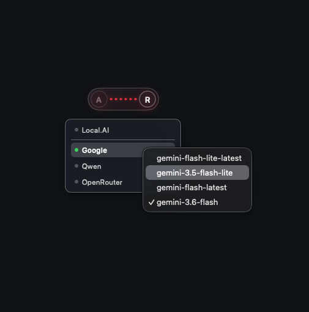
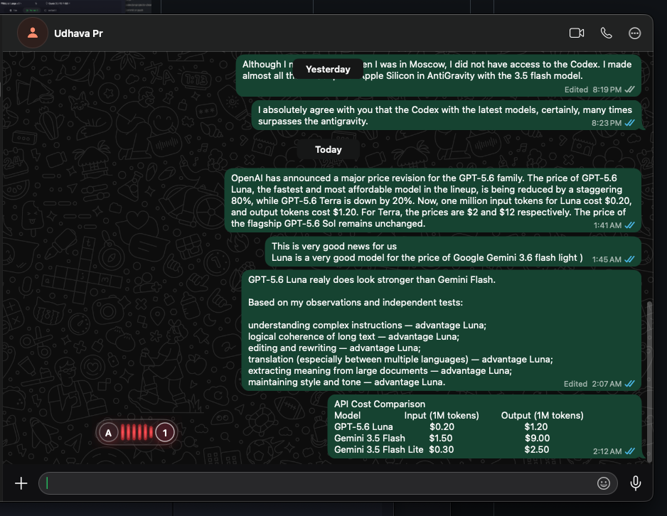
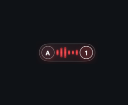
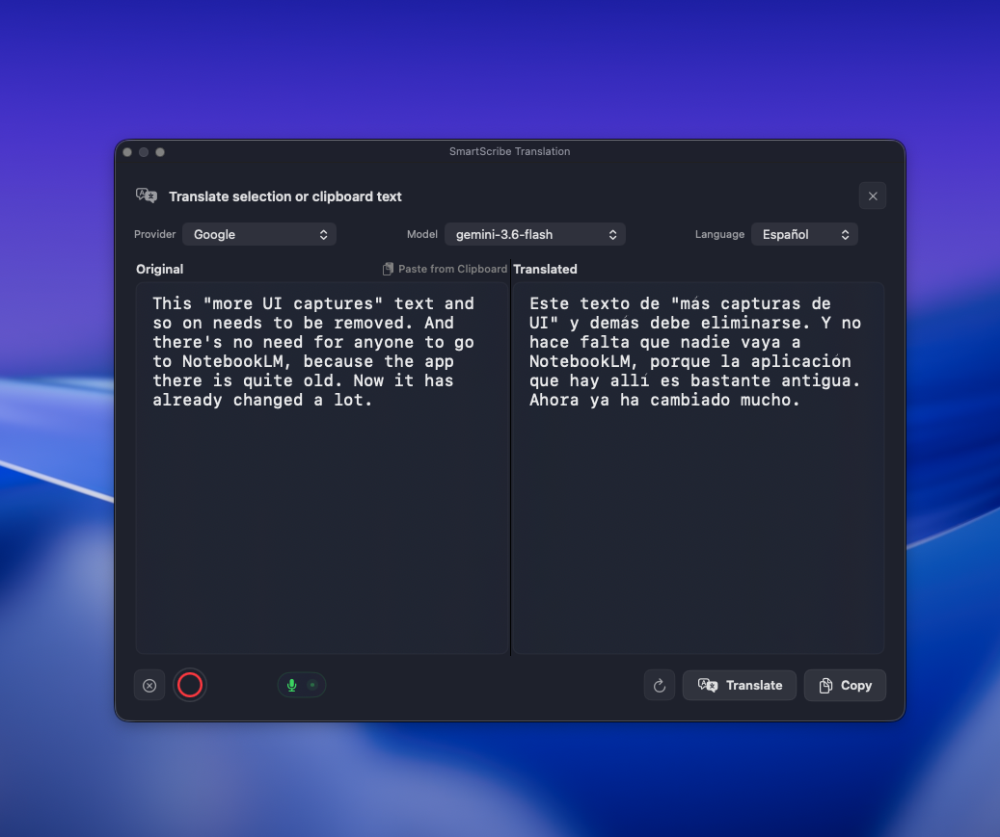
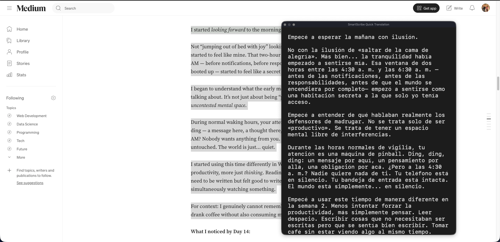
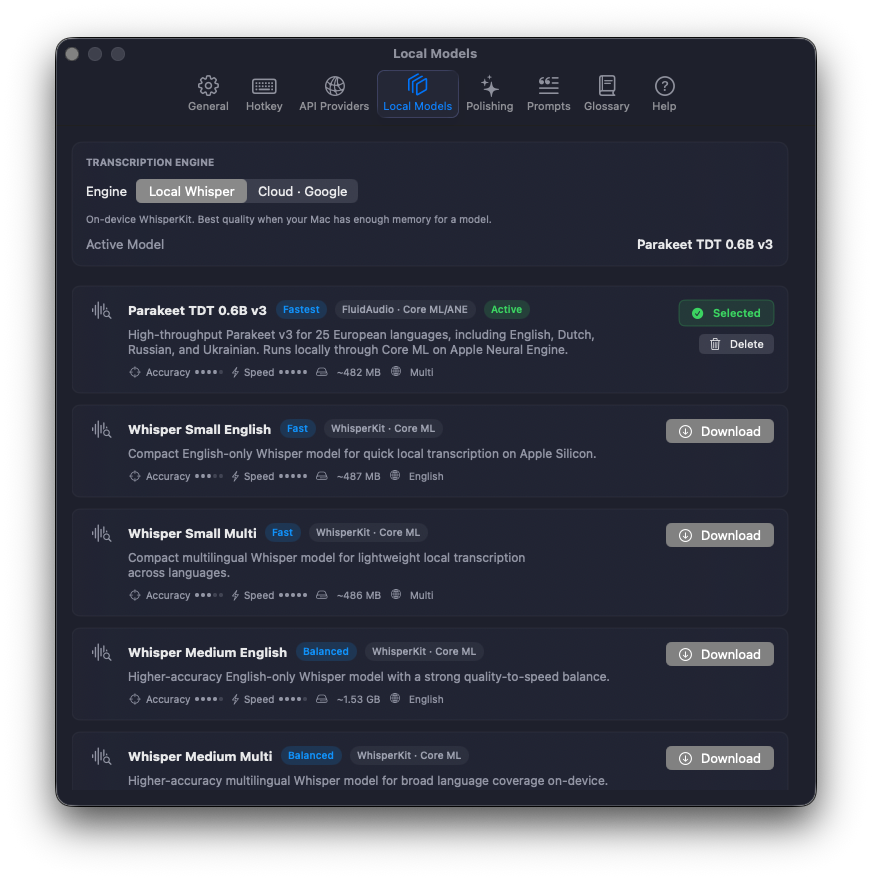
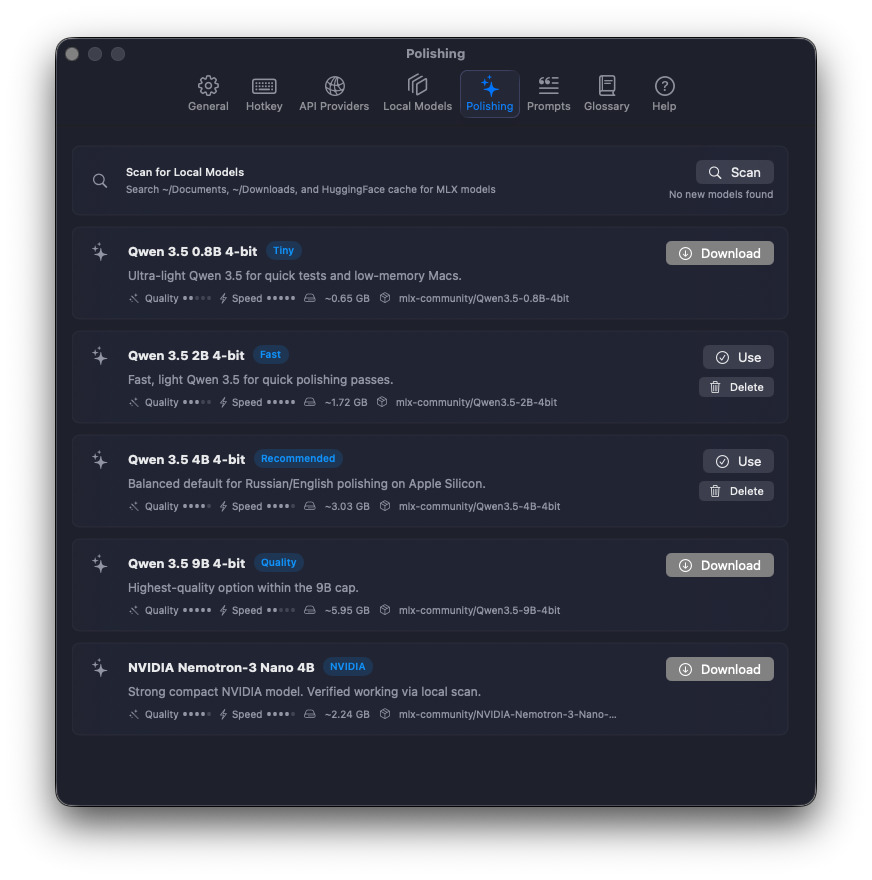
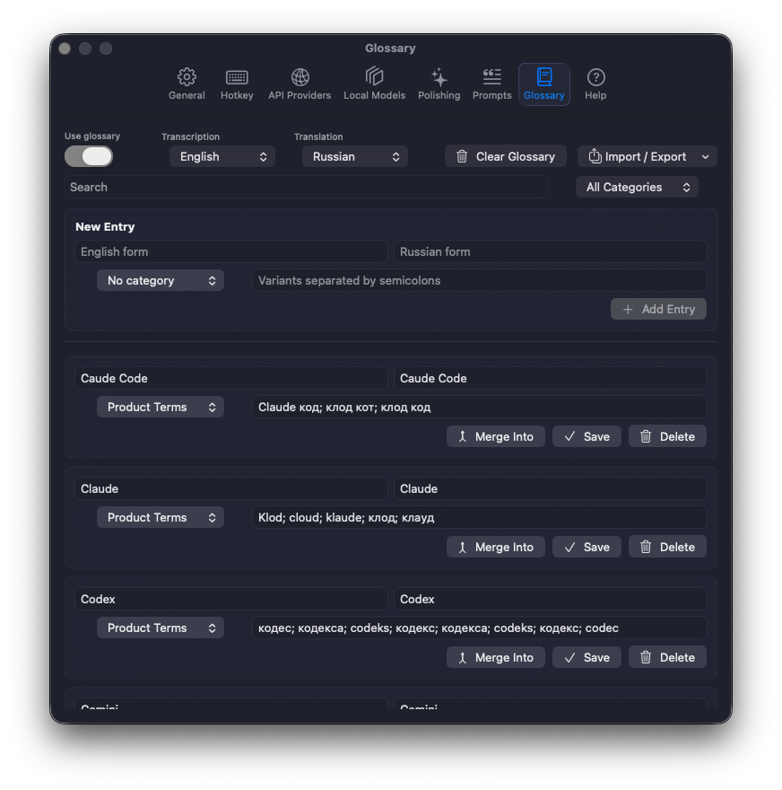
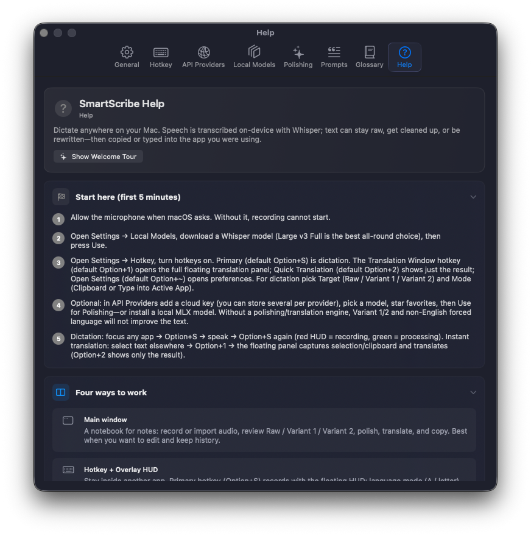

<p align="center">
  
  
</p>

<h1 align="center">Bolabol</h1>

<p align="center">
  <strong>Your voice. Your words. Ready to use.</strong>
</p>

<p align="center">
  AI-powered voice input for your Mac.<br>
  Dictate, rewrite, translate, format, and insert polished text into any app — with local and cloud AI models.
</p>

<p align="center">
  <a href="https://github.com/Pavan-Gopa/Bolabol/releases/latest"></a>
  <a href="https://github.com/Pavan-Gopa/Bolabol/releases"></a>
  
  
  <a href="LICENSE"></a>
  <a href="COMMERCIAL.md"></a>
</p>

<p align="center">
  <a href="https://github.com/Pavan-Gopa/Bolabol/releases/latest">Download</a> ·
  <a href="#why-bolabol">Features</a> ·
  <a href="#whats-new-in-v104">What's new</a> ·
  <a href="#install-end-users">Install</a> ·
  <a href="#license--distribution">License</a>
</p>

---

## Why Bolabol

| Advantage | What it means in practice |
|-----------|---------------------------|
| **Local-first** | Speech and polishing can stay on your Mac. Nothing leaves the device unless you choose a cloud provider. |
| **Two-stage pipeline** | **Transcription** (speech → text) is separate from **polishing** (text → cleaner text). You always keep a faithful **Raw** transcript. |
| **System-wide hotkeys** | Dictate from Slack, browser, IDE, or Notes. A floating **HUD** shows recording / processing without stealing keyboard focus. |
| **Local + cloud** | Use on-device models when you want privacy and speed, or cloud APIs when you want more power — switch live from the HUD. |
| **Real workspace** | Notes history, Raw / Variant 1 / Variant 2, Markdown, glossary, translation, prompt templates, usage stats, built-in Help. |
| **Native quality** | Pure Swift / SwiftUI for Apple Silicon. Release builds support Developer ID signing and Apple notarization, with dark/light UI and 15 interface languages. |

### Under the hood (technical)

Apple Silicon only · macOS 14+ · **WhisperKit**, **Parakeet / FluidAudio**, **Canary Core ML**, and **GigaAM Core ML** local ASR · **MLX** local polishing · optional Gemini / OpenAI / Qwen / OpenRouter · not Electron.

---

## What's new in v1.0.4

### Bolabol 1.0.4 current product surface

- Local ASR includes WhisperKit, Parakeet/FluidAudio, Canary Core ML, and GigaAM Core ML. Canary 1B requires macOS 15+.
- Canary and GigaAM are ASR-only. They require an explicit source language and do not expose speech-translation targets.
- Multilingual Whisper retains its native source-to-English path where supported. Other translation is post-ASR text processing through local MLX or the selected cloud provider.
- Default hotkeys are Option+S for dictation, Option+1 for the full translation window, Option+2 for quick translation, and Option+~ for Settings.
- Google cloud dictation sends audio to Google. Cloud polishing and translation send text and prompts to the selected provider; local model paths remain local.
- Anthropic remains migration-compatible for stored settings but is not in the visible provider order.

### Carried from earlier releases

- Turkish (and ja/ko/hi) archive-stats crash fix.
- Anti-chat polishing contract; provider-aware sampling.
- HUD provider & model quick switcher (scroll / right-click).



Full changelog: [Changelog — v1.0.4](#changelog--v104) · [`docs/RELEASE_NOTES.md`](docs/RELEASE_NOTES.md).

---

## Screenshots

### Main workspace


Sidebar notes; transcription + polishing pickers; **Raw / Variant 1 / Variant 2**; record / import / translate / polish / settings.

### Floating HUD (global hotkey)

Dictate over any app — red capsule while recording, green while processing:

| Over another app | Recording | Processing |
|:---:|:---:|:---:|
|  |  |  |

**Scroll the capsule → pick provider; right-click → pick model**:


### Translation

| Full translation window | Quick translation |
|:---:|:---:|
|  |  |

### Settings

| General | Hotkeys |
|:---:|:---:|
|  |  |

| API Providers | Local Models |
|:---:|:---:|
|  |  |

| Polishing (MLX) | Prompts |
|:---:|:---:|
|  |  |

| Glossary | Help |
|:---:|:---:|
|  |  |

---

## Feature overview

### 1. Core workflow

1. **Record** in-app, or **import / drag-and-drop** an audio file.  
2. **Transcribe** with a local model (WhisperKit, Parakeet FluidAudio, Canary Core ML, or GigaAM Core ML) or optional Google Gemini cloud dictation.
3. Review **Raw** text (closest to the audio).  
4. **Polish** into **Variant 1** (light cleanup), **Variant 2** (stronger rewrite), or **Markdown**.  
5. Optionally **translate**, apply the **glossary**, copy notes, or push text into another app with a hotkey.

### 2. Transcription engines

| Engine | Runtime | Notes |
|--------|---------|--------|
| **Parakeet TDT 0.6B v3** | FluidAudio · Core ML / ANE | Fast path; ~25 European languages (incl. EN/RU/UK/NL). ASR only. |
| **Whisper Small / Medium** | WhisperKit · Core ML | English-only and multilingual variants. |
| **Whisper Large v3 Turbo** | WhisperKit · Core ML | Strong multilingual quality, faster than full Large; native English translation where supported. |
| **Whisper Large v3 Full** | WhisperKit · Core ML | Highest accuracy; solid quality default and native English translation where supported. |
| **Canary Flash / Canary 1B v2** | Core ML / ANE | ASR only with explicit source language; Canary 1B requires macOS 15+. |
| **GigaAM v3** | Core ML / ANE | Russian ASR only with explicit source language. |
| **Google Gemini (cloud)** | Gemini API | Optional cloud dictation when keys are configured. |

Models download from **Settings → Local Models**. Storage prefers a shared root (`AI_LOCAL_MODELS_DIR` / `~/AI_LOCAL_MODELS`) with Application Support fallbacks.

### 3. Text polishing

Polishing rewrites **text** with prompts — it is not a second ASR pass.

**Local (MLX Swift / GPU):**

- Qwen 3.5 — 0.8B, 2B, **4B (recommended default)**, 9B (4-bit)  
- NVIDIA Nemotron-3 Nano 4B  
- Custom / scanned local MLX models from your folders or Hugging Face cache  

**Cloud polishing providers:**

Google Gemini · OpenAI · Qwen (OpenAI-compatible) · OpenRouter · custom OpenAI-compatible base URL

Multi-key support, enable/disable keys, model pickers, retries for stalled cloud requests, optional “polishing disabled” mode. Anthropic remains migration-compatible for stored settings but is not shown in the current provider order.

All model-backed polishing requests include a non-conversational text-transformation system contract: questions and commands inside a transcript are edited as source material, never answered or executed. Generation settings use deterministic or low sampling where supported; model families that reject custom temperature use their documented low-reasoning/default-sampling configuration instead.

### 4. Variants, prompts, Markdown

| Output | Role |
|--------|------|
| **Raw** | Unedited transcription |
| **Variant 1** | Light cleanup (fillers, repeats, self-corrections; same language/meaning) |
| **Variant 2** | Stronger structure and wording (no inventing facts) |
| **Markdown** | Structured export via a dedicated prompt |

Customizable prompt slots: default + slots `1`–`4` + Markdown (`M`) in **Settings → Prompts**.

### 5. Global hotkeys & HUD

| Shortcut | Action |
|----------|--------|
| **⌥S** (Option+S) | Start/stop hotkey dictation |
| **⌥1** (Option+1) | Open the full translation window |
| **⌥2** (Option+2) | Open the quick translation result window |
| **⌥~** (Option+~) | Open Settings |

- Floating **HUD** (non-activating): red = recording, green = processing; draggable; position remembered  
- **Target:** Raw / Variant 1 / Variant 2  
- **Mode:** Clipboard, or **Type into Active App** (Accessibility)  
- Language control on the HUD follows each model's source-language capabilities; Canary and GigaAM remain ASR-only.
- Start/finish sounds, volume, HUD size/opacity/style in General settings  
- Scroll / right-click on the provider switcher (see above)

### 6. Translation

- Modal translator from the main toolbar
- Local MLX or cloud providers as engine
- Dictate into the modal, paste from clipboard, copy result
- Floating / quick translation windows  
- Target language for the translation windows

### 7. Glossary (local, deterministic)

- Post-ASR / post-translation term correction — **does not train or bias** models  
- Source form, translation form, categories, variant spellings  
- Import / export JSON & CSV  
- “Add to Glossary” from selected text  
- Stored under Application Support  

### 8. Notes & workspace

- Sidebar history with dates and previews  
- Per-note raw + polished variants  
- Copy one note or all notes  
- Blank note creation  
- Managed audio storage and cleanup of unreferenced files  

### 9. Settings surface

| Tab | Capabilities |
|-----|----------------|
| **General** | Theme, UI scale, fonts, interface language, HUD style/size/opacity, sounds, log level, export logs, reset |
| **Hotkeys** | Enable, shortcuts, language, Accessibility, output target/mode |
| **API Providers** | Keys, models, custom endpoints, multi-key rotation, per-provider usage stats |
| **Local Models** | Download / use / delete WhisperKit, Parakeet, Canary, and GigaAM models |
| **Polishing** | MLX models, scan local folders, engine selection |
| **Prompts** | Variant 1 / 2 / Markdown templates and slots |
| **Glossary** | Entries, import/export, auto-translation language |
| **Help** | In-app guide + replay onboarding |

### 10. Onboarding, permissions, privacy

First-run flow covers backend/model choice and microphone access. Accessibility is needed for typing into another app or capturing selected text for translation. Help can **replay onboarding**.

| Permission | Why |
|------------|-----|
| Microphone | Recording |
| Accessibility | Insert into focused apps and capture selected text for translation |
| Apple Events | Paste automation where needed |

**Privacy model**

- Local engines and local model paths stay on-device
- Google cloud dictation uploads audio to Google; cloud polishing and translation send text and prompts only when you select a provider
- API keys stay in the app credential store  
- Release builds ship **without** bundled API keys or personal data  

---

## Changelog — v1.0.4

### Current release surface

- Local ASR: WhisperKit, Parakeet/FluidAudio, Canary Core ML, and GigaAM Core ML.
- Canary and GigaAM remain ASR-only; Whisper keeps native English translation where supported.
- Translation after ASR uses local MLX or the selected cloud provider. Google cloud dictation uploads audio to Google.
- Current default hotkeys: Option+S dictation, Option+1 full translation, Option+2 quick translation, Option+~ Settings.
- API Providers shows Google, OpenAI, Qwen, OpenRouter, and Custom; Anthropic is retained for migration compatibility but hidden from the order.

Historical 1.0.3 planning and spike evidence remains in the versioned plan and workflow records; this file describes the active 1.0.4 surface.

### Install asset

- **`Bolabol.dmg`** on the [v1.0.4 release](https://github.com/Pavan-Gopa/Bolabol/releases/tag/v1.0.4) (when published).

---

## Requirements

- **Apple Silicon** Mac (M1 or later)  
- **macOS 14** Sonoma or later  
- Optional: network for model downloads and cloud providers  
- Optional: Accessibility for “Type into Active App”  

---

## Install (end users)

1. Download **`Bolabol.dmg`** from the [v1.0.4 release](https://github.com/Pavan-Gopa/Bolabol/releases/tag/v1.0.4) (sign in if the repo is private; when published).
2. Open the DMG → drag **Bolabol** into **Applications**.  
3. Launch from Applications. If Gatekeeper prompts, right-click **Bolabol** and choose **Open**.

Developers / automation can still use `./script/install.sh` from a local checkout; it is **not** required for normal install.

---

## Build from source

```bash
git clone https://github.com/Pavan-Gopa/Bolabol.git
cd Bolabol   # repository root
./script/build_and_run.sh          # debug
./script/build_and_run.sh --verify
APP_VERSION=1.0.4 ./script/build_release_dmg.sh
# notarize (credentials stored once via notarytool):
NOTARIZE=1 APP_VERSION=1.0.4 ./script/build_release_dmg.sh
```

| Product | Role |
|---------|------|
| `NativeBolabol` | Main app (bundled as `Bolabol.app`) |
| `NativeBolabolPolishWorker` | Out-of-process MLX polishing worker |
| `NativeBolabolCore` | Shared models, stores, services |
| Tests | `NativeBolabolCoreTests` |

Architecture: SwiftUI-first UI; Whisper → WhisperKit Core ML; Parakeet → FluidAudio Core ML/ANE; Canary and GigaAM → ASR-only Core ML/ANE; post-ASR text translation → selected cloud APIs or local MLX engines; polish → MLX Swift in a separate worker process.

Checklist: [`docs/RELEASE.md`](docs/RELEASE.md)

---

## Local paths

| Data | Location |
|------|----------|
| Transcription models | `AI_LOCAL_MODELS_DIR` → shared config → `~/AI_LOCAL_MODELS/whisperkit` → app-support legacy |
| MLX polish scan | `~/AI_LOCAL_MODELS/mlx`, HF cache, Documents, Downloads |
| Glossary | `~/Library/Application Support/NativeBolabol/glossary.json` |
| Logs export | `~/Library/Application Support/NativeBolabol/Logs/` |

---

## License & distribution

| Use case | Allowed? |
|----------|----------|
| **Personal / private** use (yourself, hobby, study, noncommercial) | **Free** under [PolyForm Noncommercial 1.0.0](LICENSE) |
| **Company / business** use (work devices, teams, commercial deployment) | **Paid commercial license** — see [COMMERCIAL.md](COMMERCIAL.md) |

This is **source-available**, not OSI “open source”: companies may not use Bolabol for commercial purposes without a paid agreement.

Release builds can be signed with **Developer ID Application: Stichting Kadamba Foundation (438UQRF7JV)** and notarized by Apple after release verification.

---

## Support

- In-app **Help** and onboarding replay  
- **Export System Logs** from General settings  
- Commercial licensing: [COMMERCIAL.md](COMMERCIAL.md) · email [dhamamedia@gmail.com](mailto:dhamamedia@gmail.com) · Telegram/WhatsApp [+91 84366 99835](https://wa.me/918436699835)  
