# SmartScribe

**Native macOS dictation, transcription, polishing, and translation for Apple Silicon.**

SmartScribe is a Swift/SwiftUI app that turns speech into clean text — locally on your Mac, or with optional cloud providers — and can insert the result into any app via global hotkeys.

> Apple Silicon only (M1 and later) · macOS 14+ · Private repository

---

## Screenshots

### Main workspace

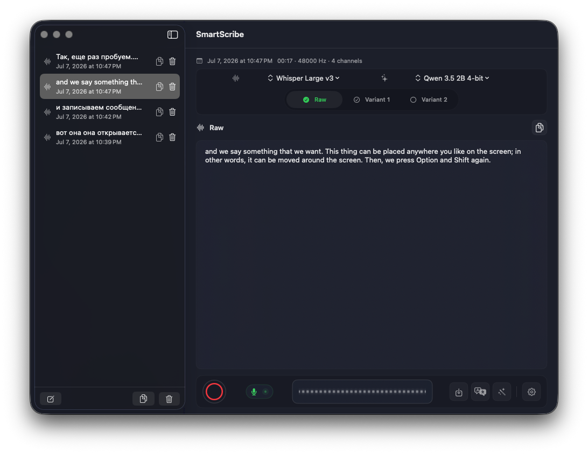

Notes on the left, the active note on the right: audio metadata, transcription model, polishing model, **Raw / Variant 1 / Variant 2**, and the action bar (record, import, translate, polish, settings).

### Transcription and polishing result tabs

| Raw (direct ASR) | Variant 1 (light cleanup) |
|:---:|:---:|
| 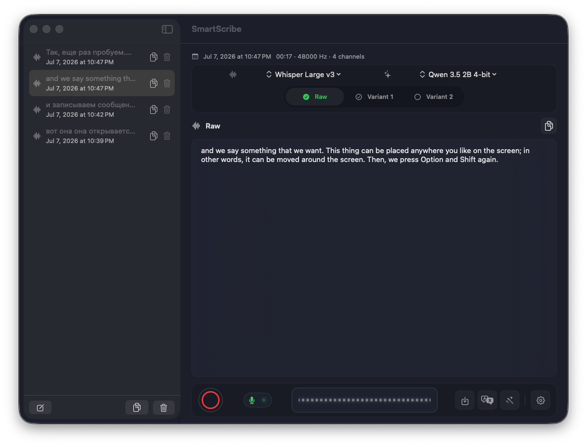 | 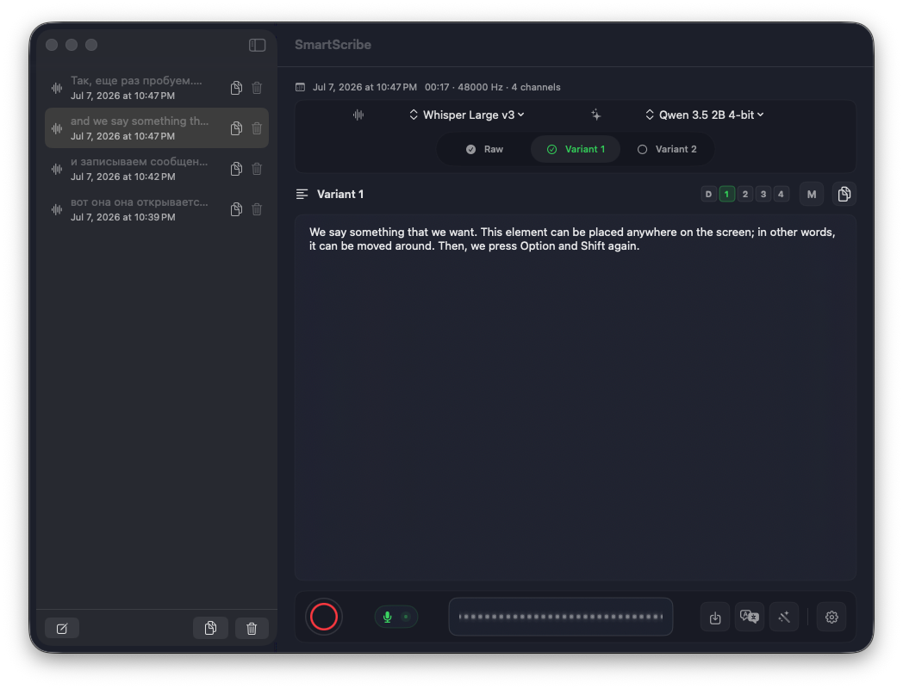 |

### Local models

| Transcription (WhisperKit / Parakeet) | Polishing (MLX) |
|:---:|:---:|
| 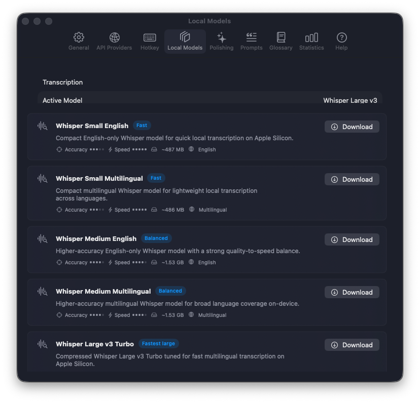 |  |

### API keys & cloud providers

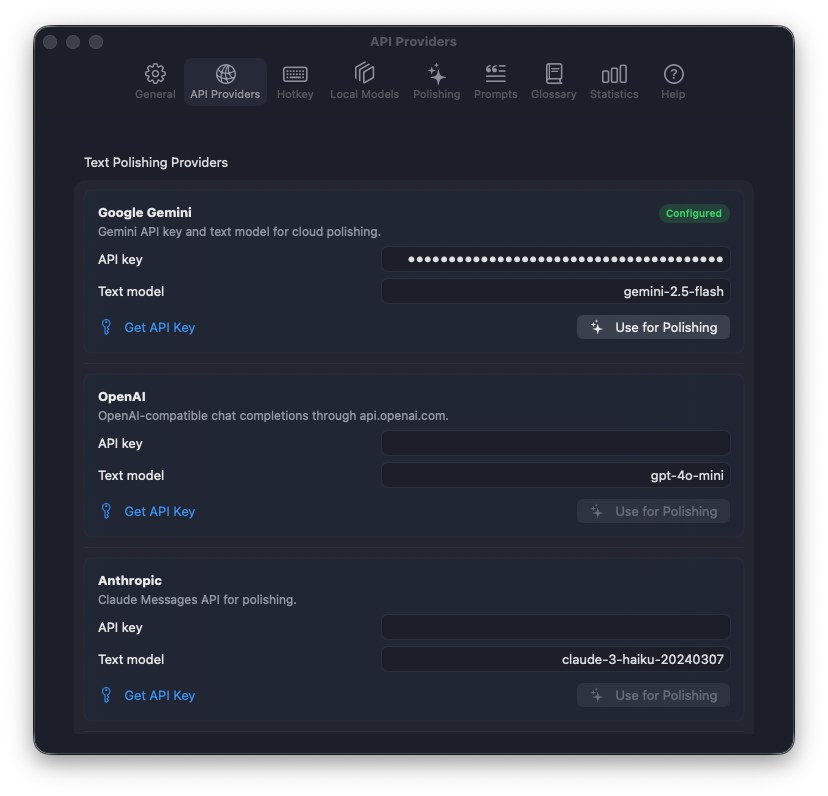

Google Gemini, OpenAI, Anthropic, Qwen, OpenRouter, and custom OpenAI-compatible endpoints. Multi-key rotation, disable/enable keys, live model catalogs where supported.

### Multilingual UI

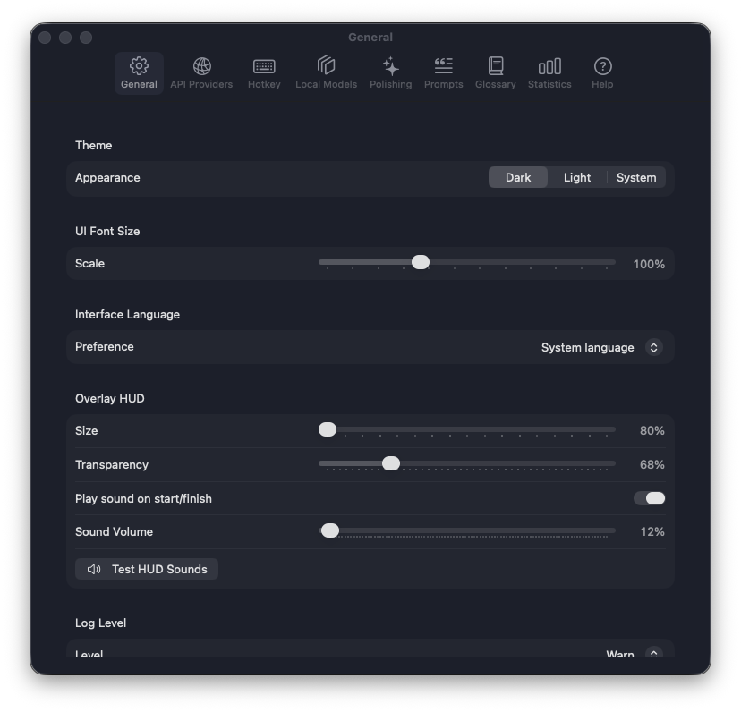

Interface languages: English, Russian, Spanish, German, French, Italian, Portuguese, Chinese, Japanese, Korean, Arabic, Hindi (plus system language). Themes: Dark / Light / System. UI scale and HUD controls.

### Global hotkeys & floating HUD

| Hotkey settings | HUD over any app |
|:---:|:---:|
| 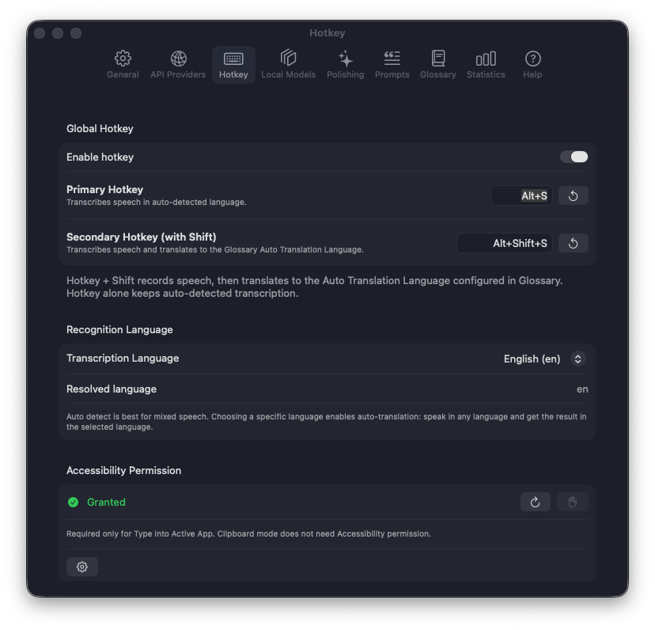 | 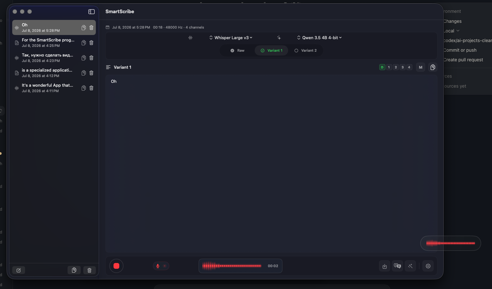 |

| Recording (red) | Processing (green) |
|:---:|:---:|
|  |  |

### Translation, glossary, prompts, help

| Translation modal | Glossary |
|:---:|:---:|
|  | 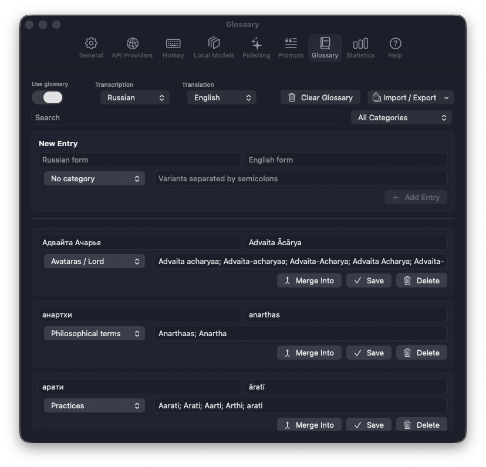 |

| Prompt templates | Built-in help |
|:---:|:---:|
| 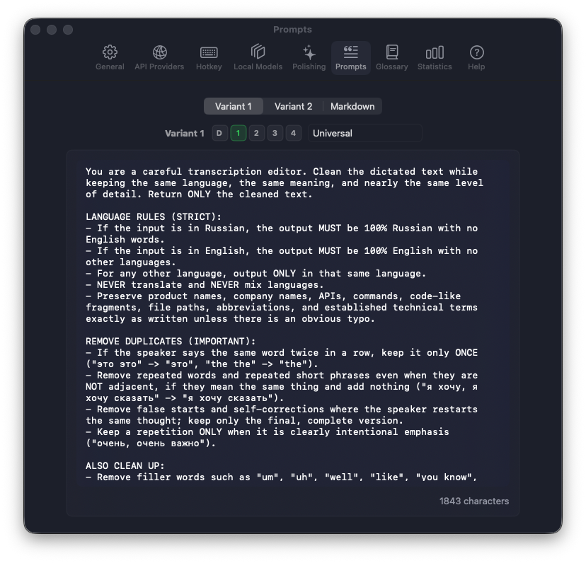 | 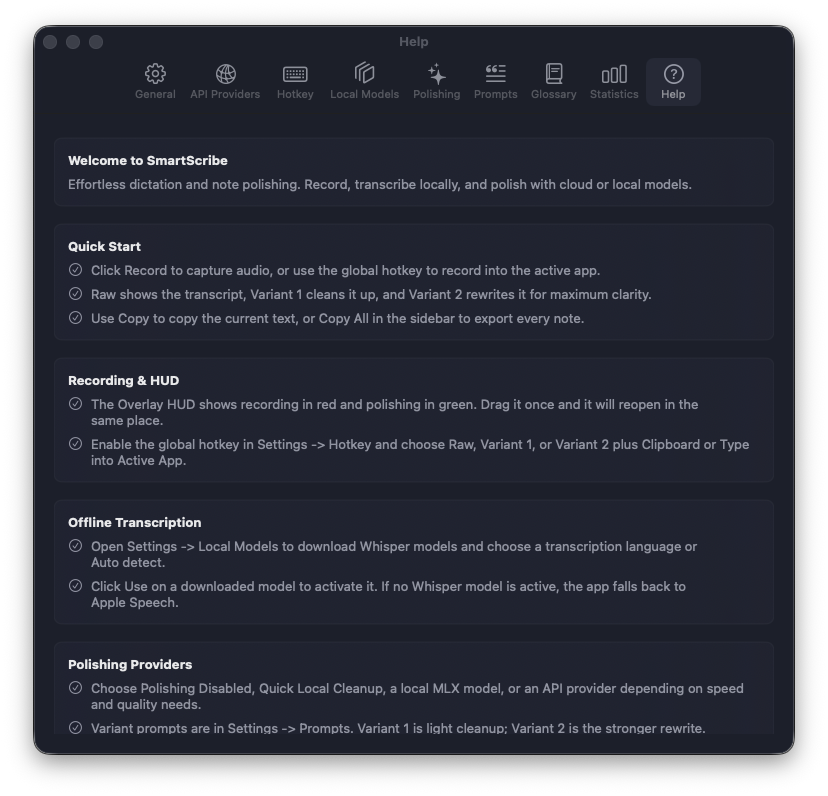 |

More UI captures and bilingual tutorial scripts live under [`docs/notebooklm-tutorial/`](docs/notebooklm-tutorial/).

---

## What SmartScribe does

### Core workflow

1. **Record** speech in-app, or **import / drag-and-drop** an audio file.
2. **Transcribe** with a local model (WhisperKit Core ML or Parakeet FluidAudio) or cloud Gemini dictation.
3. Review **Raw** text (closest to the audio).
4. **Polish** into **Variant 1** (light cleanup), **Variant 2** (stronger rewrite), or **Markdown**.
5. Optionally **translate**, apply the **glossary**, copy notes, or push text into another app with a hotkey.

### Transcription

| Engine | Runtime | Notes |
|--------|---------|--------|
| **Parakeet TDT 0.6B v3** | FluidAudio · Core ML / ANE | Fastest path; ~25 European languages (incl. EN/RU/UK/NL). ASR only — no speech→English translate. |
| **Whisper Small / Medium** | WhisperKit · Core ML | English-only and multilingual variants. |
| **Whisper Large v3 Turbo** | WhisperKit · Core ML | Strong multilingual quality, faster than full Large. |
| **Whisper Large v3 Full** | WhisperKit · Core ML | Highest accuracy; recommended default for quality. |
| **Google Gemini (cloud)** | Gemini API | Optional cloud dictation path when API keys are configured. |

Models download from inside **Settings → Local Models**. Storage prefers a shared local models root (`AI_LOCAL_MODELS_DIR` / `~/AI_LOCAL_MODELS`) with app-support fallbacks.

### Text polishing

Polishing is **separate from ASR**. It rewrites text with prompts (not audio).

**Local (MLX Swift / GPU):**

- Qwen 3.5 — 0.8B, 2B, **4B (recommended)**, 9B (4-bit)
- NVIDIA Nemotron-3 Nano 4B
- Custom / scanned local MLX models (e.g. `prism-ml/Bonsai-27B-mlx-1bit` via Prism 1-bit MLX kernels — no llama.cpp/GGUF for polishing)

**Cloud polishing providers:**

- Google Gemini
- OpenAI
- Anthropic
- Qwen (OpenAI-compatible)
- OpenRouter
- Custom OpenAI-compatible base URL

Features: multi-key support, key enable/disable, model pickers, retries for stalled cloud requests, optional “polishing disabled” mode.

### Variants, prompts, Markdown

- **Raw** — unedited transcription
- **Variant 1** — light cleanup (fillers, repeats, self-corrections; same language/meaning)
- **Variant 2** — stronger structure and wording (no inventing facts)
- **Markdown** — structured export via dedicated prompt
- Customizable prompt slots: default + slots `1`–`4` + Markdown (`M`) in **Settings → Prompts**

### Global hotkeys & HUD

| Shortcut | Action |
|----------|--------|
| **⌥S** (Option+S) | Start/stop hotkey dictation |
| **⇧⌥S** (Shift+Option+S) | Same, then auto-translate to Glossary **Auto Translation Language** |

- Floating **HUD** (non-activating overlay): red = recording, green = processing; draggable; position remembered
- **Target:** Raw / Variant 1 / Variant 2
- **Mode:** Clipboard, or **Type into Active App** (Accessibility permission)
- Recognition language control on the HUD (disabled for Parakeet and English-only Whisper where not applicable)
- Start/finish sounds, volume, HUD size/opacity in General settings

### Translation

- Modal translator from the main toolbar
- Local MLX or cloud providers as engine
- Dictate into the translation modal, paste from clipboard, copy result
- Floating / quick translation windows for lighter workflows
- Auto-translation language for the Shift+Option+S hotkey path

### Glossary (local, deterministic)

- Post-ASR / post-translation term correction — **does not train or bias** Whisper/Parakeet/LLMs
- Source form, translation form, categories, variant spellings
- Import / export JSON & CSV
- “Add to Glossary” from selected text in a note
- Stored under Application Support

### Notes & workspace

- Sidebar history with dates and previews
- Per-note raw + polished variants
- Copy one note or all notes
- Blank note creation
- Managed audio file storage and cleanup of unreferenced files

### Settings surface

| Tab | Capabilities |
|-----|----------------|
| **General** | Theme, UI scale, interface language, HUD, sounds, log level, export system logs, reset |
| **Local Models** | Download / use / delete Whisper & Parakeet models |
| **Polishing** | MLX models, scan local folders, engine selection |
| **API Providers** | Keys, models, custom endpoints, multi-key rotation |
| **Hotkeys** | Enable, shortcuts, language, Accessibility, output target/mode |
| **Prompts** | Variant 1 / 2 / Markdown templates and slots |
| **Glossary** | Entries, import/export, auto-translation language |
| **Statistics** | Usage metrics |
| **Help** | In-app guide + replay onboarding |

### Onboarding & permissions

First-run flow covers backend/model choice, microphone, speech recognition, and Accessibility (for typing into other apps). Help can **replay onboarding**. System permissions:

- Microphone — recording
- Speech recognition — Apple Speech paths where used
- Accessibility — insert into focused apps
- Apple Events — paste automation where needed

### Privacy model

- **Local-first:** WhisperKit / Parakeet / MLX run on-device
- Cloud is **opt-in** via API keys; text leaves the machine only when you choose a cloud engine
- API keys stay on the device (app credential store); screenshots in docs mask secrets

---

## Requirements

- **Apple Silicon** Mac (M1 or later)
- **macOS 14** Sonoma or later
- Optional: network for model downloads and cloud providers
- Optional: Accessibility for “Type into Active App”

---

## Install (end users)

### Option A — DMG (GUI)

1. Download `SmartScribe.dmg` from the [private Releases](https://github.com/Pavan-Gopa/SmartScribe/releases) page (sign in to GitHub).
2. Open the DMG and drag **SmartScribe** into **Applications**.
3. First launch: right-click → Open if Gatekeeper prompts (notarized builds open normally after Apple verification).

### Option B — Terminal (recommended for automation)

From a machine that already has the DMG (or a GitHub CLI session with access to this private repo):

```bash
# Install from a local DMG path
./script/install.sh /path/to/SmartScribe.dmg

# Or download the latest private GitHub release asset and install
./script/install.sh --from-github
```

One-liner after `gh auth login` (repo must stay private; requires read access):

```bash
gh release download -R Pavan-Gopa/SmartScribe -p 'SmartScribe*.dmg' -D /tmp \
  && hdiutil attach /tmp/SmartScribe.dmg -nobrowse -quiet \
  && ditto "/Volumes/SmartScribe/SmartScribe.app" /Applications/SmartScribe.app \
  && hdiutil detach "/Volumes/SmartScribe" -quiet \
  && echo "Installed → /Applications/SmartScribe.app"
```

`script/install.sh` wraps the same steps, verifies the app bundle, and opens Applications if you pass `--open`.

---

## Build from source (developers)

```bash
git clone https://github.com/Pavan-Gopa/SmartScribe.git
cd SmartScribe   # this repository is the NativeAppleSilicon tree
./script/build_and_run.sh          # debug / day-to-day
./script/build_and_run.sh --verify
./script/build_release_dmg.sh      # Release .app + signed SmartScribe.dmg
```

Optional notarization (Developer ID already used for signing):

```bash
# Store credentials once (app-specific password or App Store Connect API key):
xcrun notarytool store-credentials "SmartScribe-Notary" \
  --apple-id "you@example.com" \
  --team-id "438UQRF7JV" \
  --password "app-specific-password"

./script/notarize_dmg.sh dist/SmartScribe.dmg
```

### Targets

| Product | Role |
|---------|------|
| `NativeSmartScribe` | Main app (bundled as `SmartScribe.app`) |
| `NativeSmartScribePolishWorker` | Out-of-process MLX polishing worker |
| `NativeSmartScribeCore` | Shared models, stores, services |
| Tests | `NativeSmartScribeCoreTests` |

### Architecture notes

- SwiftUI-first UI; AppKit only where macOS requires it (hotkeys, AX insertion, overlays)
- Protocol-oriented audio, transcription, polishing, and model management
- Whisper → Core ML via WhisperKit; Parakeet → FluidAudio Core ML/ANE; polish → MLX Swift (+ Prism kernels for 1-bit models)

---

## Release branch

Post–code-review release line:

| Item | Value |
|------|--------|
| Branch | `codex/parakeet-bonsai` |
| Review follow-up | `041fbdc` — *fix: resolve code review findings (5549 → 141)* |
| Recent feature work | Parakeet + Bonsai local models, Google polish retries, Parakeet audio normalization |

Default remote: `origin` → `https://github.com/Pavan-Gopa/SmartScribe` (**private**).

---

## Local model paths

Transcription (resolved in order):

1. `AI_LOCAL_MODELS_DIR` if set  
2. `~/Library/Application Support/AILocalModels/config.json`  
3. default `~/AI_LOCAL_MODELS/whisperkit`  
4. legacy `~/Library/Application Support/NativeSmartScribe/Models/Transcription/WhisperKit`

MLX polish scan locations include `~/AI_LOCAL_MODELS/mlx`, Hugging Face hub cache, Documents, Downloads.

Glossary data: `~/Library/Application Support/NativeSmartScribe/glossary.json`  
Logs export: `~/Library/Application Support/NativeSmartScribe/Logs/`

---

## License & distribution

Source and releases are hosted in a **private** GitHub repository. Distribution is intended for authorized recipients only. Builds are signed with **Developer ID Application: Stichting Kadamba Foundation (438UQRF7JV)** and submitted to Apple notarization before public-facing handoff.

---

## Support

- In-app **Help** tab and onboarding replay  
- **Export System Logs** from General settings for diagnostics  
- Tutorial storyboard (EN/RU): [`docs/notebooklm-tutorial/`](docs/notebooklm-tutorial/)
